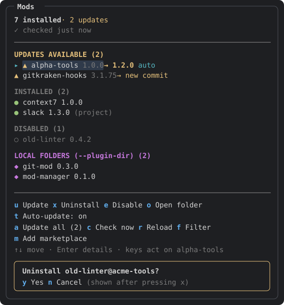

# mod-manager

A `/mod-manager` side pane for Claude Code that lists every mod and plugin you have installed. From the pane you can **update** a mod from its marketplace, **uninstall** it, **enable or disable** it, **reload** plugins, and **open** its folder or homepage. Each time the pane opens, it checks the marketplaces in the background and marks the mods that are **out of date**. You can also turn on **auto-update** for each mod or for all of them, and **add a marketplace from a GitHub or GitLab URL**, then pick which of its plugins to install.

Tested with Claude Code 2.1.291 on Windows 11. It uses only cross-platform calls, so it also runs on macOS and Linux, in the terminal and in the Code tab of Claude Desktop. It needs Claude Code **2.1.287 or later** because mods were added in that version.



## Install

Inside Claude Code:
```
/plugin marketplace add netgfx/claude-mod-manager
/plugin install mod-manager@claude-mod-manager
/reload-plugins
```

From a shell (PowerShell, Bash or Zsh):
```bash
claude plugin marketplace add netgfx/claude-mod-manager
claude plugin install mod-manager@claude-mod-manager --scope user
```
Then start Claude Code (or run `/reload-plugins`) and type `/mod-manager`. `/mods` is a shorter name for the same command. You only get `/mods` if no other plugin has already taken that name.

With `--scope user`, the mod loads in every session, so `/mod-manager` works in any project. You can use mod-manager to update mod-manager itself.

## Using it

```
/mod-manager          open the pane and focus it (checks for updates in the background)
/mod-manager check    check for updates without opening the pane
/mod-manager close    close the pane
/mod-manager add <repo>   add a GitHub/GitLab repo as a marketplace, then pick plugins to install
```

When the terminal is in fullscreen layout and wide enough, the pane docks as a sidebar on the right. Otherwise it sits inline above the prompt. Press **Ctrl+X then Tab** to move focus back into the pane after you've typed in the prompt.

### List view

```
╭─ Mods ─────────────────────────────────────────────────────╮
│ 7 installed · 2 updates                                    │  ← counts
│ ⟳ checking marketplaces…                                   │  ← background check status
│ ────────────────────────────────────────────────────────── │
│ UPDATES AVAILABLE (2)                                      │
│ ▸ ▲ alpha-tools       1.0.0 → 1.2.0  auto                  │  ← ▸ = the mod the keys act on; auto = auto-update on
│   ▲ gitkraken-hooks   3.1.75 → new commit                  │
│                                                            │
│ INSTALLED (2)                                              │
│   ● context7          1.0.0                                │
│   ● slack             1.3.0  (project)                     │  ← non-user scopes are shown
│                                                            │
│ DISABLED (1)                                               │
│   ○ old-linter        0.4.2                                │
│                                                            │
│ LOCAL FOLDERS (--plugin-dir) (2)                           │
│   ◆ git-mod           0.3.0                                │
│   ◆ mod-manager       0.1.0                                │
│ ────────────────────────────────────────────────────────── │
│ u Update  x Uninstall  e Disable  o Open folder            │  ← act on the ▸ mod
│ t Auto-update: on                                          │
│ a Update all (2)  c Check now  r Reload  f Filter          │  ← act on everything
│ m Add marketplace                                          │
│ ↑↓ move · Enter details · keys act on alpha-tools          │
╰────────────────────────────────────────────────────────────╯
```

### Detail view (press Enter on a mod)

```
╭─ Mods ─────────────────────────────────────────────────────╮
│ b ‹ Back to list                                           │
│                                                            │
│ alpha-tools                                                │
│ Formatting and lint helpers for TypeScript projects        │
│                                                            │
│ Status      ▲ update available                             │
│             Version 1.2.0 is available                     │
│ Installed   1.0.0                                          │
│ Latest      1.2.0                                          │
│ Marketplace acme-tools                                     │
│ Scope       user                                           │
│ Enabled     yes                                            │
│ Auto-update on                                             │
│ Updated     2026-09-21                                     │
│ Folder      C:\Users\me\.claude\plugins\cache\…\1.0.0      │
│ Homepage    https://github.com/acme/alpha-tools            │
│ ────────────────────────────────────────────────────────── │
│ u Update  x Uninstall  e Disable  o Open folder            │
│ t Auto-update: on                                          │
│ h Homepage  p Copy folder path  r Reload                   │
╰────────────────────────────────────────────────────────────╯
```

### Add a marketplace from a URL (press m)

Paste a repository URL and press Enter. The pane runs `claude plugin marketplace add` and reads the repo's `marketplace.json`. It then lists the plugins in that marketplace with every plugin you don't have yet ticked. Untick any you don't want and press `i`:

```
╭─ Mods ─────────────────────────────────────────────────────╮    ╭─ Mods ─────────────────────────────────────────────────────╮
│ b ‹ Back to list                                           │    │ b ‹ Done (skip installing)                                 │
│                                                            │    │                                                            │
│ ADD A MARKETPLACE                                          │    │ team-tools                                                 │
│ Paste a GitHub or GitLab repository. It must have          │    │ Shared Claude Code mods for the platform team              │
│ .claude-plugin/marketplace.json at its root.               │    │ ✓ Added marketplace team-tools: 3 plugins.                 │
│                                                            │    │ ────────────────────────────────────────────────────────── │
│ Repository  gitlab.com/acme/team-tools█        [add]       │ →  │ [✓] lint-guard      1.4.0                                  │
│                                                            │    │     Blocks commits that fail the linter                    │
│ Accepted forms:                                            │    │ [ ] deploy-pane     0.9.2                                  │
│   owner/repo                                               │    │     A /deploy side pane                                    │
│   https://github.com/owner/repo                            │    │ [•] git-mod         0.3.0  installed                       │
│   https://gitlab.com/group/project                         │    │ ────────────────────────────────────────────────────────── │
│   git@gitlab.com:group/project.git                         │    │ i Install selected (1)  s Select all                       │
╰────────────────────────────────────────────────────────────╯    ╰────────────────────────────────────────────────────────────╯
```

- **GitHub**: `owner/repo`, `https://github.com/owner/repo`, links to a branch or file such as `…/tree/main/…`, and `git@github.com:owner/repo.git` are all reduced to `owner/repo`. The CLI tries SSH first, then HTTPS.
- **GitLab**: `gitlab.com` or a self-hosted GitLab. `https://gitlab.com/group/sub/project`, including links such as `…/-/tree/main`, becomes `https://gitlab.com/group/sub/project.git`. A `git@…` SSH URL is used as it is.
- **Any other git host**: an `https://…` or `git@…` URL is passed through. `.git` is added to `https` URLs unless they already end in `.git` or `.json`.
- **Wrong structure**: if the repo has no `.claude-plugin/marketplace.json`, the pane says so, and no marketplace is added. A missing or private repo gets its own message.
- **Already added**: if you paste a marketplace you already have, the pane opens its plugin list so you can install more of them.
- Plugins are installed with `--scope user`, so they load in every project. Press `r` afterwards to load them.
- Only URL characters (`A–Z a–z 0–9 . _ ~ : / @ # + -`) are accepted. The text never goes through a shell.

### Auto-update

- Press **`t`** on a mod to turn auto-update on or off for that mod. The choice is saved on your machine, applies to every session, and shows as a cyan `auto` tag on the row.
- To auto-update **every** mod, turn on the `auto_update` setting. A mod you switched off with `t` stays off.
- Auto-update runs after every check: when the pane opens, a few seconds after a session starts, and every `check_interval_hours`. If an update fails, it isn't tried again until the next session.
- After auto-updating, the pane shows a toast and asks you to reload. Turn on `auto_reload` to have it run `/reload-plugins` by itself once the session is idle.
- Turning `t` on for a mod that's already out of date updates it straight away.

### Confirmations and results

Uninstall and Update all ask first. Each action shows its result at the top of the pane, and if plugins need a reload it tells you so:

```
╭────────────────────────────────────╮
│ Uninstall old-linter@acme-tools?   │      ⟳ Updating alpha-tools…
│ y Yes   n Cancel                   │      ✓ Updated alpha-tools 1.0.0 → 1.2.0. Press r to reload plugins and apply it.
╰────────────────────────────────────╯      Changes apply after a reload.  Reload now
                                            ✕ Could not update alpha-tools: <first line of the CLI error>
```

### Controls

| Key | Where | Action |
| --- | --- | --- |
| `↑` `↓` / `Tab` | list | Move between mods and buttons. The `▸` follows the focus |
| `Enter` | list | Open the highlighted mod's details |
| `u` | list, details | **Update** the mod to the marketplace's latest version (`claude plugin update`) |
| `x` | list, details | **Uninstall** the mod. Asks `y` / `n` first (`claude plugin uninstall`) |
| `e` | list, details | **Enable / Disable** the mod (`claude plugin enable` / `disable`) |
| `o` | list, details | **Open** the mod's install folder in Explorer, Finder, or your file manager |
| `t` | list, details | Turn **auto-update** on or off for the mod |
| `m` | list | **Add a marketplace** from a GitHub/GitLab URL |
| `Enter` | add view | Add the repository you typed |
| `Enter` | plugin picker | Tick or untick the plugin |
| `i` | plugin picker | **Install** the ticked plugins |
| `s` | plugin picker | Select all / none |
| `a` | list | **Update all** outdated mods. Asks first |
| `c` | list | **Check now**: refresh the marketplaces and compare versions again |
| `r` | list, details | **Reload** plugins (`/reload-plugins`) so updates and removals take effect |
| `f` | list | **Filter** by name, marketplace or description. Text filters as you type, Enter keeps it, `f` again clears it |
| `h` | details | Open the mod's **homepage** |
| `p` | details | **Copy** the install folder path |
| `b` | details, add, picker | Back to the list |
| `y` / `n` | confirmations | Confirm / cancel |
| `Esc` | anywhere | Close the pane |

In the terminal, a key only does something while the pane has focus. While the filter field has focus, every key you type goes into the field. Press `↓` or `Tab` to leave the field.

### Status glyphs

| Glyph | Meaning |
| --- | --- |
| `▲` yellow | An update is available, either a newer version or a newer pinned commit |
| `●` green | Up to date |
| `○` dim | Disabled |
| `◆` magenta | Loaded from a local folder with `--plugin-dir` or `CLAUDE_CODE_PLUGIN_DIRS`. The pane shows these but doesn't update or uninstall them |
| `·` | Still checking |
| `?` | The marketplace doesn't say which version is newest |
| `✕` red | No longer listed in its marketplace |

## Capabilities

- **Shows every installed plugin** from `claude plugin list`, in every scope (`user`, `project`, `local`, `managed`), plus the session-only mods loaded from folders.
- **Checks for updates in the background.** The check runs every time the pane opens, a few seconds after each session starts, and again every few hours (you can change this). The pane appears at once, and the list fills in while the check runs:
  1. It runs `claude plugin marketplace update <name>` for each marketplace your mods came from.
  2. It reads that marketplace's `marketplace.json`. It finds the newest version from, in order: the entry's `version`; the `plugin.json` inside the marketplace, for relative sources; a version-like `ref` such as `v1.5.5`; or the pinned commit `sha`.
  3. It compares the newest version with the installed one, numerically, so `1.10.0` counts as newer than `1.9.3`. It also compares the git commit recorded in `installed_plugins.json`, which catches updates pushed without a version bump. For a git source that has no pin, it asks the remote with `git ls-remote`.
- **Auto-update**, set per mod or for all mods, with an optional automatic reload afterwards.
- **Add a marketplace from a URL**: paste a GitHub or GitLab repo, check that it has the right structure, add it, then choose which of its plugins to install.
- **Status line badge**: `▲ 2 mod updates · /mod-manager` appears under the prompt when updates are waiting, even while the pane is closed.
- **One-key actions** with confirmations for the destructive ones, a busy indicator, and the CLI's error text when an action fails.
- **Reload prompt**: after you change anything, the pane reminds you to reload and offers a button for it. The pane's data is kept in session state, so it survives the reload.
- **Search/filter**, a **details view**, **open folder / homepage**, and **copy path**.
- **Works on Windows, macOS and Linux**, in the terminal and in Desktop. `claude` is started directly, and on Windows it falls back to `cmd /c claude`, then to `~/.local/bin/claude`.

## Settings

Change these in `/config` (look for the mod-manager rows), or in `pluginConfigs` in `~/.claude/settings.json` under the key `mod-manager@claude-mod-manager`.

| Key | Default | Meaning |
| --- | --- | --- |
| `check_on_start` | `true` | Check for updates in the background a few seconds after a session starts |
| `check_interval_hours` | `6` | How often to check again while a session stays open. `0` turns this off |
| `show_status` | `true` | Show the `▲ N mod updates` badge in the status line |
| `auto_update` | `false` | Auto-update every marketplace mod. A mod's own `t` choice overrides this |
| `auto_reload` | `false` | Run `/reload-plugins` once the session is idle after an auto-update |
| `auto_open` | `false` | Open the pane when a session starts. A pane that opens by itself waits until the terminal is at least 144 columns wide |

## Good to know

- Changes take effect after a reload. Claude Code applies plugin updates and removals on `/reload-plugins` or the next start, so press `r` after you change something.
- An update only works for a plugin that came from a marketplace. Mods loaded from a folder (`◆`) are yours to edit in that folder.
- Some marketplaces declare an install command that you have to confirm, such as a `headersHelper`. For security, the pane never passes `--yes`. If the CLI asks for confirmation, the pane tells you which `claude plugin update …` command to run in a terminal.
- The pane changes nothing behind your back. The background check only refreshes marketplace catalogs (`claude plugin marketplace update`) and reads files. Plugins are installed, removed or toggled only when you press a key. The one exception is the mods you turned auto-update on for.
- The `$` calls this mod makes, as `claude plugin validate` lists them: `$.process.run` (the `claude` CLI, `git ls-remote`, and `explorer.exe`, `open` or `xdg-open`), `$.fs.read` (marketplace catalogs, `plugin.json`, `installed_plugins.json`), `$.command.register` / `$.command.run` (`/reload-plugins`), `$.store.get` / `$.store.set` (the per-mod auto-update choices), `$.env.get` (`OS`, `HOME`, `USERPROFILE`), `$.ui.*`, `$.clock.*`, and `$.state.*`. It makes no network calls of its own. All network access goes through the `claude` and `git` CLIs.

## Load it from a local folder (development)

PowerShell:
```powershell
git clone git@github.com:netgfx/claude-mod-manager.git
claude --plugin-dir .\claude-mod-manager
```
Bash/Zsh:
```bash
git clone git@github.com:netgfx/claude-mod-manager.git
claude --plugin-dir ./claude-mod-manager
```
Changes you save hot-reload into the running session. To load the folder in the Desktop app, add it to `env.CLAUDE_CODE_PLUGIN_DIRS` in `~/.claude/settings.json`. Use absolute paths, separated by `;` on Windows and `:` on macOS and Linux.

```bash
claude plugin validate .      # checks plugin.json, marketplace.json and the hooks module
claude plugin test            # runs tests/*.test.ts (Windows- and macOS-shaped environments)
```
Before a release, bump `version` in both `.claude-plugin/plugin.json` and `.claude-plugin/marketplace.json`. Installed plugins are cached by version, so without a bump users won't get the update.

## Ideas for later

- **Browse & install**: a second tab that lists the plugins your marketplaces offer and installs one with a key. `claude plugin list --available --json` already provides this list.
- **Changelog preview**: show the commits or `CHANGELOG.md` entries between the installed version and the latest one before you update.
- **Skip this version**: hide one update you don't want, stored per machine in `$.store`.
- **Auto-update per marketplace**: turn auto-update on for every plugin from one marketplace, for example your team's.
- **Marketplace management**: list, refresh and remove marketplaces from the pane. Adding them already works.
- **Health info**: per-mod hook errors and load time, read from the debug log.

## Repository layout
```
.claude-plugin/
  plugin.json        plugin manifest (with userConfig settings)
  marketplace.json   marketplace manifest: this repo is a one-plugin marketplace
hooks/
  hooks.json         points Claude Code at the hooks module
  register.js        the pane, the update check, and the actions
types/index.d.ts     the $.state keys the pane uses
tests/               claude plugin test suites
docs/images/         README illustration
```

## License
MIT. See [LICENSE](LICENSE).
